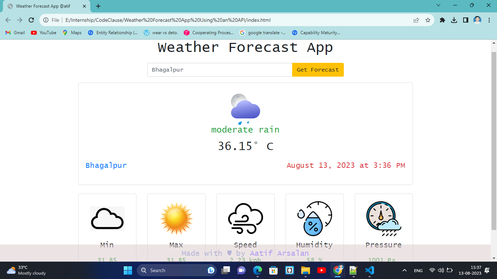

# CodeClauseInternship_weather-forecast-app-using-an-API

It displays real-time weather of any location. [OpenWeatherMap](https://openweathermap.org/api) API is used to access current weather data for any location.

# Software_Requirements : IDE- Brackets/VS Code

# Stack: HTML, CSS, Javascript and Bootstrap4

Show some ❤️ by starring this repo.!

